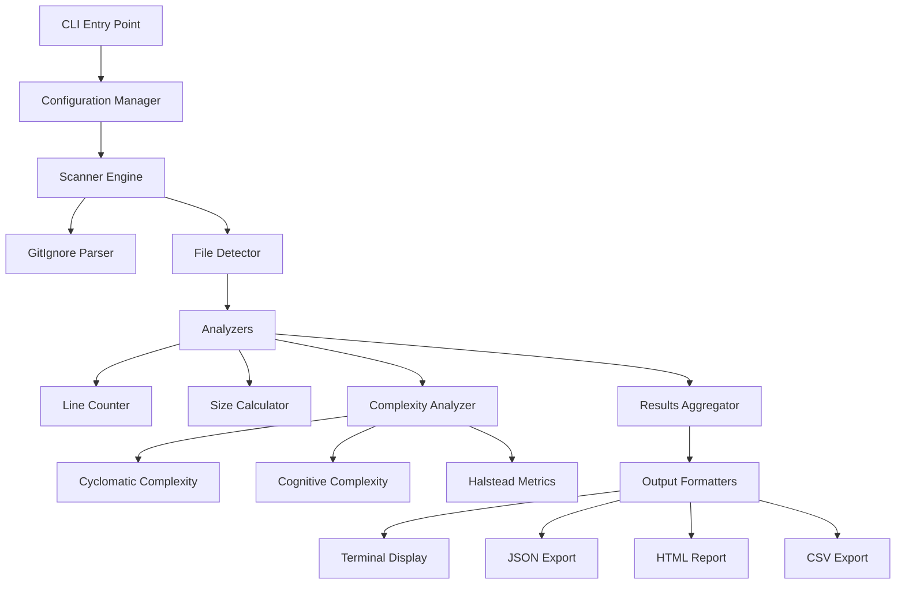

# Product Requirement Document
## Code Insight Analyzer

**Version:** 1.0  
**Date:** January 2025  
**Author:** Product Team

---

## 1. Executive Summary

The **Code Insight Analyzer** is a Python-based command-line tool that provides comprehensive analysis of source code repositories. It respects `.gitignore` rules, counts lines of code, measures file sizes, and analyzes code complexity metrics. Think of it as an **MRI scanner for your codebase** - it doesn't just show you what's there, but reveals the health and complexity of your code structure.

### Key Differentiators
- **Modern Stack**: Python 3.13 with uv package manager for blazing-fast dependency management
- **Complexity Analysis**: Beyond counting lines - understanding code quality
- **Beautiful Output**: Rich terminal UI with actionable insights
- **Polyglot Support**: 60+ programming languages and frameworks

---

## 2. Problem Statement

### Current Pain Points
1. **Lack of Visibility**: Developers struggle to understand the true size and complexity of their codebases
2. **Hidden Technical Debt**: Complex code areas remain undiscovered until they cause problems
3. **Inefficient Analysis**: Existing tools are slow, don't respect .gitignore, or require complex setup
4. **Poor Developer Experience**: Command-line tools with ugly, hard-to-read output

### Target Users
- **Primary**: Individual developers analyzing their projects
- **Secondary**: Team leads assessing technical debt
- **Tertiary**: DevOps engineers monitoring code health

---

## 3. Goals and Objectives

### Primary Goals (Must Have - MVP)
✅ **Already Implemented:**
- Scan directories recursively for source code files
- Respect .gitignore patterns at all directory levels
- Count lines of code per file
- Display file sizes in human-readable format
- Sort results by line count
- Beautiful terminal output using Rich

🎯 **To Be Implemented:**
- Python 3.13 compatibility
- uv package manager integration
- Code complexity analysis (Cyclomatic, Cognitive)
- Export results to JSON/CSV/HTML
- Configuration file support (.codeinsight.yml)

### Secondary Goals (Should Have)
- Duplicate code detection
- Code smell identification
- Historical tracking (compare analyses over time)
- Integration with CI/CD pipelines
- Language-specific complexity metrics

### Future Goals (Nice to Have)
- Web dashboard
- IDE plugins (VS Code, IntelliJ)
- Real-time file watching
- AI-powered code quality suggestions
- Team collaboration features

---

## 4. Technical Requirements

### 4.1 Technology Stack

```yaml
runtime:
  python: ">=3.13"
  package_manager: "uv"

dependencies:
  core:
    - rich: ">=14.0.0"      # Terminal UI
    - radon: ">=6.0.0"       # Complexity analysis
    - pygments: ">=2.17.0"   # Syntax highlighting
    - pydantic: ">=2.5.0"    # Data validation
    - typer: ">=0.9.0"       # CLI framework
  
  analysis:
    - ast: "builtin"         # Abstract Syntax Tree
    - lizard: ">=1.17.0"     # Cyclomatic complexity
    - flake8: ">=7.0.0"      # Code quality
  
  export:
    - pandas: ">=2.1.0"      # Data manipulation
    - jinja2: ">=3.1.0"      # HTML templates
    - openpyxl: ">=3.1.0"    # Excel export

development:
  testing:
    - pytest: ">=7.4.0"
    - pytest-cov: ">=4.1.0"
    - pytest-mock: ">=3.12.0"
  
  quality:
    - ruff: ">=0.1.0"        # Linting
    - black: ">=23.0.0"      # Formatting
    - mypy: ">=1.7.0"        # Type checking
```

### 4.2 System Architecture



### 4.3 Domain Model

```python
# Core Domain Models
@dataclass
class FileMetrics:
    path: Path
    relative_path: str
    language: Language
    lines_of_code: int
    blank_lines: int
    comment_lines: int
    size_bytes: int
    last_modified: datetime

@dataclass
class ComplexityMetrics:
    cyclomatic_complexity: float
    cognitive_complexity: float
    halstead_metrics: HalsteadMetrics
    maintainability_index: float
    technical_debt_ratio: float

@dataclass
class CodeInsights:
    file_metrics: FileMetrics
    complexity_metrics: Optional[ComplexityMetrics]
    code_smells: List[CodeSmell]
    duplications: List[Duplication]
    
@dataclass
class AnalysisReport:
    project_path: Path
    timestamp: datetime
    total_files: int
    total_lines: int
    total_size: int
    language_distribution: Dict[Language, int]
    complexity_summary: ComplexitySummary
    top_complex_files: List[CodeInsights]
    recommendations: List[Recommendation]
```

---

## 5. Feature Specifications

### 5.1 Complexity Analysis Engine

**Cyclomatic Complexity (McCabe)**
- Measures independent paths through code
- Thresholds: Simple (1-10), Moderate (11-20), Complex (21-50), Very Complex (50+)

**Cognitive Complexity (Sonar)**
- Measures how difficult code is to understand
- Considers nesting, logical operators, and control flow

**Implementation Example:**
```python
class ComplexityAnalyzer:
    def analyze_python_file(self, file_path: Path) -> ComplexityMetrics:
        # Parse AST
        tree = ast.parse(file_path.read_text())
        
        # Calculate metrics
        cyclomatic = self.calculate_cyclomatic(tree)
        cognitive = self.calculate_cognitive(tree)
        halstead = self.calculate_halstead(tree)
        
        return ComplexityMetrics(...)
```

### 5.2 Configuration System

**File: `.codeinsight.yml`**
```yaml
version: 1.0

# Language-specific settings
languages:
  python:
    max_line_length: 88
    complexity_threshold: 10
  typescript:
    max_line_length: 100
    complexity_threshold: 15

# Analysis rules
analysis:
  ignore_patterns:
    - "*.generated.*"
    - "*_pb2.py"
  
  complexity:
    include_docstrings: false
    count_assertions: true
  
  thresholds:
    file_too_long: 500
    function_too_complex: 20
    class_too_large: 1000

# Output preferences
output:
  format: "terminal"  # terminal, json, html, csv
  theme: "monokai"
  show_recommendations: true
  export_path: "./reports"
```

### 5.3 Command-Line Interface

```bash
# Basic usage with uv
uv run codeinsight analyze .

# With complexity analysis
uv run codeinsight analyze . --complexity

# Export to multiple formats
uv run codeinsight analyze . \
  --output terminal \
  --export json,html \
  --export-dir ./reports

# Compare two analyses
uv run codeinsight compare \
  ./reports/2025-01-01.json \
  ./reports/2025-01-15.json

# Watch mode for real-time analysis
uv run codeinsight watch . --complexity
```

---

## 6. User Experience

### 6.1 Terminal Output Design

```
╭─────────────────────────────────────────────────────────────╮
│              Code Insight Analyzer v1.0                     │
│         Project: /Users/udi/my-flutter-app                  │
╰─────────────────────────────────────────────────────────────╯

📊 Analysis Summary
──────────────────
  Total Files:        156
  Lines of Code:      12,847
  Total Size:         487.3 KB
  Languages:          Dart (67%), Python (18%), TypeScript (15%)

🔥 Complexity Hotspots (Top 5)
────────────────────────────
┏━━━━━━━━━━━━━━━━━━━━━━━━━━━━┳━━━━━━━┳━━━━━━━━━━━┳━━━━━━━━━━━━┓
┃ File                       ┃ Lines ┃ Complexity ┃ Risk Level ┃
┡━━━━━━━━━━━━━━━━━━━━━━━━━━━━╇━━━━━━━╇━━━━━━━━━━━╇━━━━━━━━━━━━┩
│ lib/services/auth.dart     │  542  │    45.2    │ 🔴 High    │
│ lib/widgets/dashboard.dart │  389  │    38.7    │ 🟠 Medium  │
│ backend/api/routes.py      │  267  │    28.3    │ 🟠 Medium  │
│ lib/models/user.dart       │  198  │    22.1    │ 🟡 Low     │
│ src/utils/validator.ts     │  156  │    18.5    │ 🟢 Good    │
└────────────────────────────┴───────┴────────────┴────────────┘

💡 Recommendations
─────────────────
  • Consider refactoring auth.dart - complexity exceeds threshold
  • dashboard.dart has 8 code smells - review needed
  • Found 3 duplicate code blocks across 6 files

📈 Trend: Code complexity increased by 12% since last analysis

[View Full Report] [Export JSON] [Export HTML] [Settings]
```

### 6.2 HTML Report Template

```html
<!DOCTYPE html>
<html>
<head>
    <title>Code Insight Report</title>
    <style>
        /* Modern, responsive design */
        body { 
            font-family: 'Inter', system-ui, sans-serif;
            background: linear-gradient(135deg, #667eea 0%, #764ba2 100%);
        }
        .metric-card {
            background: white;
            border-radius: 12px;
            padding: 24px;
            box-shadow: 0 10px 40px rgba(0,0,0,0.1);
        }
        .complexity-badge {
            display: inline-block;
            padding: 4px 12px;
            border-radius: 20px;
            font-weight: 600;
        }
        .complexity-high { background: #fee2e2; color: #dc2626; }
        .complexity-medium { background: #fed7aa; color: #ea580c; }
        .complexity-low { background: #fef3c7; color: #d97706; }
        .complexity-good { background: #d1fae5; color: #059669; }
    </style>
</head>
<body>
    <!-- Interactive charts with Chart.js -->
    <!-- Sortable tables with DataTables -->
    <!-- Expandable code snippets with syntax highlighting -->
</body>
</html>
```

---

## 7. Performance Requirements

### 7.1 Benchmarks

| Metric | Target | Maximum |
|--------|--------|---------|
| Startup Time | < 100ms | 500ms |
| Files/Second | > 1000 | - |
| Memory Usage | < 100MB for 10K files | 500MB |
| Analysis Time (1K files) | < 2s | 5s |
| Export Time (JSON) | < 500ms | 2s |

### 7.2 Optimization Strategies

```python
# Parallel processing for large codebases
from concurrent.futures import ProcessPoolExecutor
from pathlib import Path
import multiprocessing

class ParallelAnalyzer:
    def __init__(self):
        self.max_workers = multiprocessing.cpu_count()
    
    async def analyze_directory(self, path: Path):
        files = self.discover_files(path)
        
        # Batch files for parallel processing
        batches = self.create_batches(files, batch_size=100)
        
        with ProcessPoolExecutor(max_workers=self.max_workers) as executor:
            futures = [
                executor.submit(self.analyze_batch, batch)
                for batch in batches
            ]
            
        return self.aggregate_results(futures)
```

---

## 8. Testing Strategy

### 8.1 Test Coverage Requirements
- Unit Tests: > 90% coverage
- Integration Tests: All major workflows
- Performance Tests: Benchmark suite
- Regression Tests: Historical compatibility

### 8.2 Test Structure

```python
# tests/test_complexity_analyzer.py
import pytest
from codeinsight.analyzers import ComplexityAnalyzer

class TestComplexityAnalyzer:
    @pytest.fixture
    def analyzer(self):
        return ComplexityAnalyzer()
    
    @pytest.mark.parametrize("code,expected_complexity", [
        ("def simple(): return 1", 1),
        ("def complex(): \n  if x: return 1\n  else: return 2", 2),
    ])
    def test_cyclomatic_complexity(self, analyzer, code, expected_complexity):
        result = analyzer.calculate_cyclomatic(code)
        assert result == expected_complexity
    
    def test_cognitive_complexity_with_nesting(self, analyzer):
        code = """
        def nested():
            for i in range(10):
                if i > 5:
                    for j in range(5):
                        if j > 2:
                            print(i, j)
        """
        result = analyzer.calculate_cognitive(code)
        assert result > 10  # High cognitive complexity due to nesting
```

---

## 9. Installation & Setup

### 9.1 Quick Start with uv

```bash
# Install uv (if not already installed)
curl -LsSf https://astral.sh/uv/install.sh | sh

# Clone repository
git clone https://github.com/yourorg/code-insight-analyzer.git
cd code-insight-analyzer

# Install with uv
uv sync

# Run the analyzer
uv run codeinsight analyze .
```

### 9.2 Docker Support

```dockerfile
FROM python:3.13-slim

# Install uv
RUN pip install uv

WORKDIR /app
COPY pyproject.toml uv.lock ./
RUN uv sync --frozen

COPY . .

ENTRYPOINT ["uv", "run", "codeinsight"]
```

---

## 10. Release Plan

### Phase 1: MVP (Week 1-2)
- [x] Basic file scanning and line counting
- [x] GitIgnore support
- [x] Rich terminal output
- [ ] Python 3.13 migration
- [ ] uv package manager setup
- [ ] Basic complexity analysis

### Phase 2: Enhanced Analysis (Week 3-4)
- [ ] Cyclomatic complexity
- [ ] Cognitive complexity
- [ ] Code smell detection
- [ ] Export to JSON/CSV
- [ ] Configuration file support

### Phase 3: Advanced Features (Week 5-6)
- [ ] HTML reports with charts
- [ ] Historical comparison
- [ ] Duplicate detection
- [ ] CI/CD integration
- [ ] Performance optimizations

### Phase 4: Polish (Week 7-8)
- [ ] Documentation
- [ ] Tutorial videos
- [ ] Community feedback integration
- [ ] v1.0 release

---

## 11. Success Metrics

### 11.1 Key Performance Indicators (KPIs)

| Metric | Target (3 months) | Target (6 months) |
|--------|------------------|-------------------|
| GitHub Stars | 500 | 2,000 |
| Monthly Active Users | 1,000 | 5,000 |
| CI/CD Integrations | 50 | 200 |
| Community Contributors | 10 | 30 |
| Average User Rating | 4.5/5 | 4.7/5 |

### 11.2 User Feedback Metrics
- Setup time: < 2 minutes
- Time to first insight: < 30 seconds
- User satisfaction score: > 8/10
- Feature adoption rate: > 60%

---

## 12. Risks and Mitigations

| Risk | Impact | Probability | Mitigation |
|------|--------|-------------|------------|
| Python 3.13 compatibility issues | High | Low | Maintain 3.11+ compatibility layer |
| Performance degradation on large repos | High | Medium | Implement streaming and pagination |
| Language parser accuracy | Medium | Medium | Use established AST libraries |
| uv adoption barriers | Low | Low | Provide pip fallback option |

---

## 13. Appendices

### A. Supported Languages (Full List)
- **Primary**: Python, TypeScript/JavaScript, Dart/Flutter
- **Secondary**: Go, Rust, Java, C#, Swift, Kotlin
- **Configuration**: YAML, JSON, TOML, XML, .env
- **Web**: HTML, CSS/SCSS, Vue, React, Svelte
- **Database**: SQL, GraphQL
- **Documentation**: Markdown, reStructuredText

### B. Complexity Metrics Explained

**Cyclomatic Complexity**: Counts decision points (if, for, while, etc.)
**Cognitive Complexity**: Weights nesting and logical operators
**Halstead Metrics**: Vocabulary size and program length
**Maintainability Index**: Composite score (0-100)

### C. Integration Examples

```yaml
# GitHub Actions
name: Code Analysis
on: [push, pull_request]
jobs:
  analyze:
    runs-on: ubuntu-latest
    steps:
      - uses: actions/checkout@v3
      - uses: astral/setup-uv@v1
      - run: uv sync
      - run: uv run codeinsight analyze . --export json
      - uses: actions/upload-artifact@v3
        with:
          name: code-analysis
          path: reports/
```

---

**Document Version**: 1.0  
**Last Updated**: January 2025  
**Next Review**: February 2025
