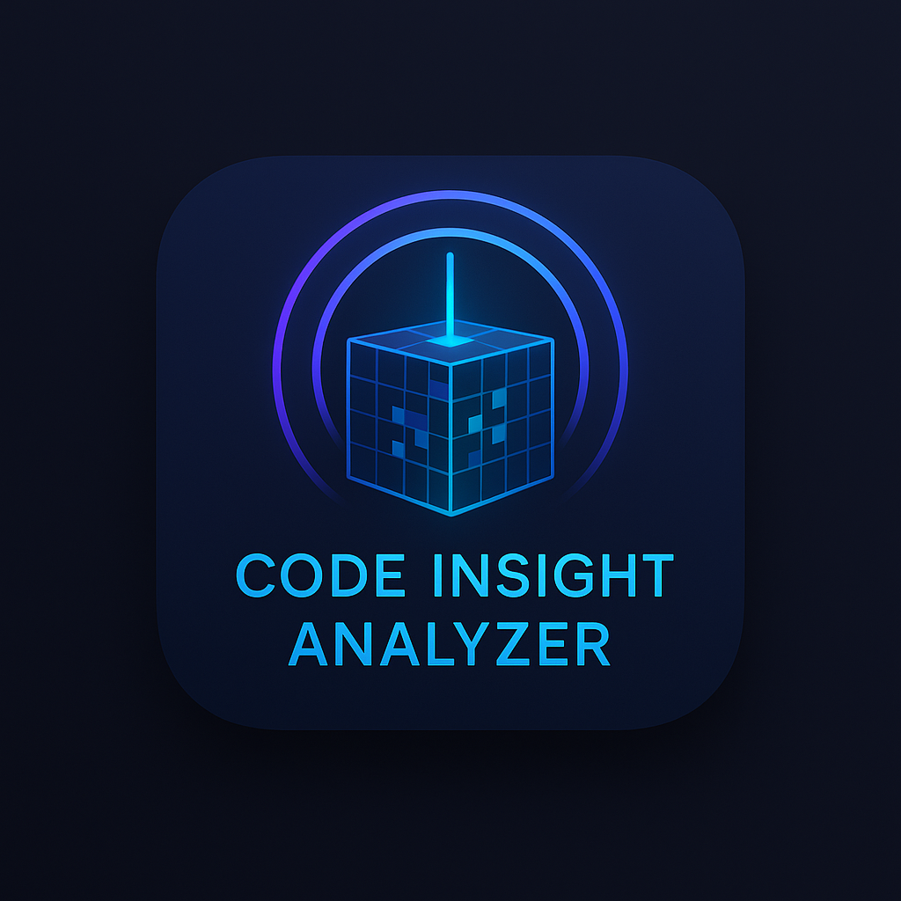

# Code Analyzer

[](https://github.com/moinsen-dev/code-analyzer/actions)
[](https://www.python.org/downloads/)
[](LICENSE)
[](https://codecov.io/gh/moinsen-dev/code-analyzer)
[](https://badge.fury.io/py/code_analyzer)
[](docs/ci-cd-integration.md)



A Python-based command-line tool that provides comprehensive analysis of source code repositories. Think of it as an **MRI scanner for your codebase** - it doesn't just show you what's there, but reveals the health and complexity of your code structure.


## Features

- Scans directories recursively for source code files
- Respects `.gitignore` patterns at all directory levels
- Counts lines of code per file
- Displays file sizes in human-readable format
- Sorts results by line count
- Beautiful terminal output using Rich
- Code complexity analysis (Cyclomatic, Cognitive, Halstead)
- Duplicate code detection using AST-based analysis
- Export results to JSON/CSV/HTML
- Configuration file support (.code_analyzer.yml)
- Multi-language support (60+ programming languages)
- Performance optimizations with parallel processing
- CI/CD integration support (GitHub Actions, GitLab CI)
- Real-time file watching for live code analysis
- Advanced AST-based duplicate code detection with clone type classification

## Duplicate Code Detection

The Code Analyzer provides advanced AST-based duplicate code detection with the following features:

- **Clone Type Classification**: Identifies different types of code clones:
  - **Exact Clones** (Type-1): Identical code except for comments and whitespace
  - **Renamed Clones** (Type-2): Syntactically identical with identifier renames
  - **Modified Clones** (Type-3): Semantically similar with small modifications
  - **Semantic Clones** (Type-4): Functionally equivalent but syntactically different

- **Cross-File Detection**: Finds duplicate code patterns across different files in your project

- **Similarity Scoring**: Provides quantitative similarity measures between code blocks (0.0 to 1.0)

- **Performance Optimizations**: Uses caching and global indexing for efficient analysis of large codebases

The duplicate detection can be customized with the `duplicates` command:

```bash
# Analyze for exact duplicates only
uv run code_analyzer duplicates src/ --type exact

# Find similar code with minimum similarity threshold
uv run code_analyzer duplicates src/ --min-similarity 0.8

# Focus on renamed clones
uv run code_analyzer duplicates src/ --type renamed
```

## Installation

First, install [uv](https://github.com/astral-sh/uv) if you haven't already:

```bash
curl -LsSf https://astral.sh/uv/install.sh | sh
```

Then install the dependencies:

```bash
uv sync
```

Or install directly from PyPI:

```bash
pip install code_analyzer
```

## Usage

### Basic Analysis

```bash
# Analyze current directory
uv run code_analyzer analyze .

# Analyze specific directory
uv run code_analyzer analyze /path/to/project

# Include complexity analysis
uv run code_analyzer analyze . --complexity
```

### Real-time Watching

```bash
# Watch current directory for changes
uv run code_analyzer watch .

# Watch with complexity analysis
uv run code_analyzer watch . --complexity
```

### Output Formats

```bash
# Display in terminal (default)
uv run code_analyzer analyze . --output terminal

# Export to JSON
uv run code_analyzer analyze . --export json --export-dir ./reports

# Export to multiple formats
uv run code_analyzer analyze . --export json,html --export-dir ./reports
```

### Advanced Usage

```bash
# Compare two analysis reports
uv run code_analyzer compare reports/report1.json reports/report2.json

# Initialize configuration file
uv run code_analyzer init

# Analyze for duplicate code with advanced options
uv run code_analyzer duplicates src/ --type exact --min-similarity 0.9
```

## Supported Languages

The Code Analyzer supports 60+ programming languages:

- **Primary**: Python, JavaScript/TypeScript, Java, C#, C++/C, Go, Rust
- **Mobile**: Dart/Flutter, Swift, Kotlin
- **Web**: HTML, CSS/SCSS, Vue, React, Svelte
- **Scripting**: PHP, Ruby
- **Configuration**: YAML, JSON, TOML, XML
- **Data**: SQL, GraphQL
- **Documentation**: Markdown, reStructuredText

## Configuration

Create a `.code_analyzer.yml` file in your project root:

```yaml
version: 1.0

# Language-specific settings
languages:
  python:
    max_line_length: 88
    complexity_threshold: 10
  typescript:
    max_line_length: 100
    complexity_threshold: 15

# Analysis rules
analysis:
  ignore_patterns:
    - "*.generated.*"
    - "*_pb2.py"
    - "*.min.js"
    - "node_modules/"
    - ".git/"

  complexity:
    include_docstrings: false
    count_assertions: true

  thresholds:
    file_too_long: 500
    function_too_complex: 20
    class_too_large: 1000

# Output preferences
output:
  format: "terminal"  # terminal, json, html, csv
  theme: "monokai"
  show_recommendations: true
  export_path: "./reports"
```

## CI/CD Integration

Code Analyzer provides built-in support for popular CI/CD platforms:

### GitHub Actions

To integrate Code Analyzer into your GitHub Actions workflow, create a workflow file in `.github/workflows/`:

```yaml
name: Code Analysis
on: [push, pull_request]

jobs:
  analyze:
    runs-on: ubuntu-latest
    steps:
      - uses: actions/checkout@v4
      - name: Run Code Analysis
        uses: moinsen-dev/code-analyzer@v0.2.0
        with:
          args: analyze . --complexity --export json,html
```

Alternatively, you can install and run it directly:

```yaml
- name: Install uv
  uses: astral-sh/setup-uv@v3

- name: Install code_analyzer
  run: |
    uv pip install code_analyzer

- name: Run analysis
  run: |
    code_analyzer analyze . --complexity --export json,html --export-dir ./reports
```

### GitLab CI

For GitLab CI, add this to your `.gitlab-ci.yml`:

```yaml
analyze:
  stage: test
  script:
    - pip install code_analyzer
    - code_analyzer analyze . --complexity --export json,html --export-dir ./reports
  artifacts:
    paths:
      - reports/
```

See [CI/CD Integration Guide](docs/ci-cd-integration.md) for more detailed instructions.

## Documentation

For detailed documentation, visit our [GitHub Pages site](https://moinsen-dev.github.io/code-analyzer/).

See [CHANGELOG.md](CHANGELOG.md) for release history.

## Contributing

We welcome contributions! Please see our [Contributing Guide](docs/contributing.md) for more information.

## Release Process

New versions are automatically published to PyPI when a new tag is created following the pattern `v*.*.*`. To release a new version:

1. Update the version in `pyproject.toml` and `setup.py`
2. Create a new tag: `git tag -a v1.0.0 -m "Release version 1.0.0"`
3. Push the tag: `git push origin v1.0.0`
4. The GitHub Actions workflow will automatically build and publish to PyPI